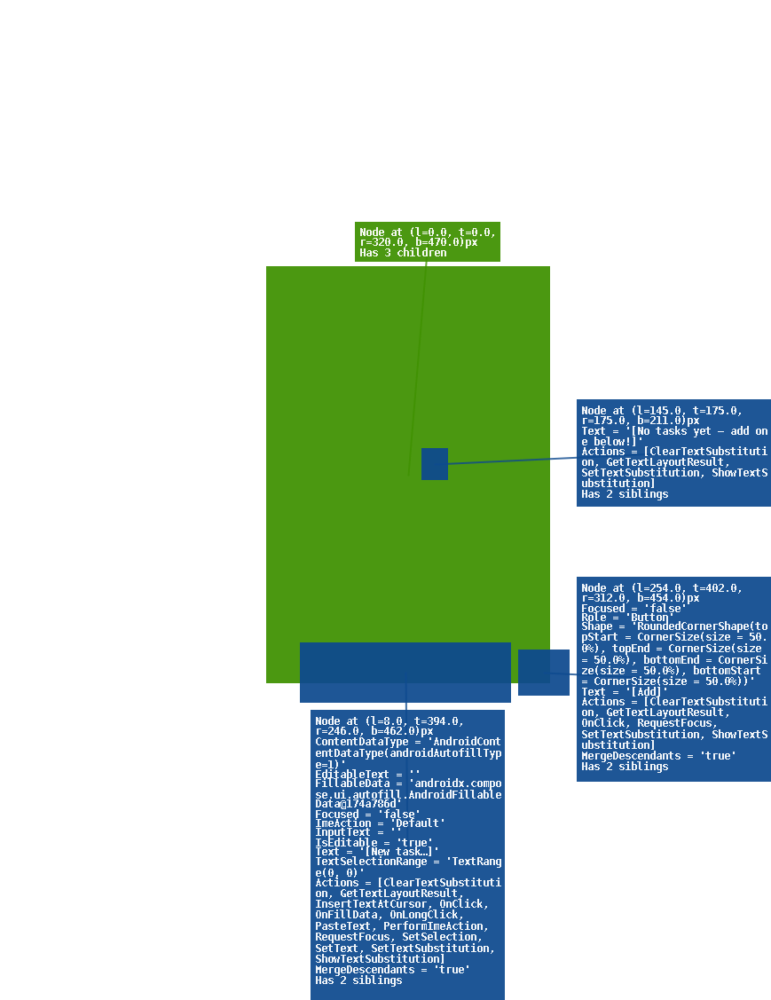
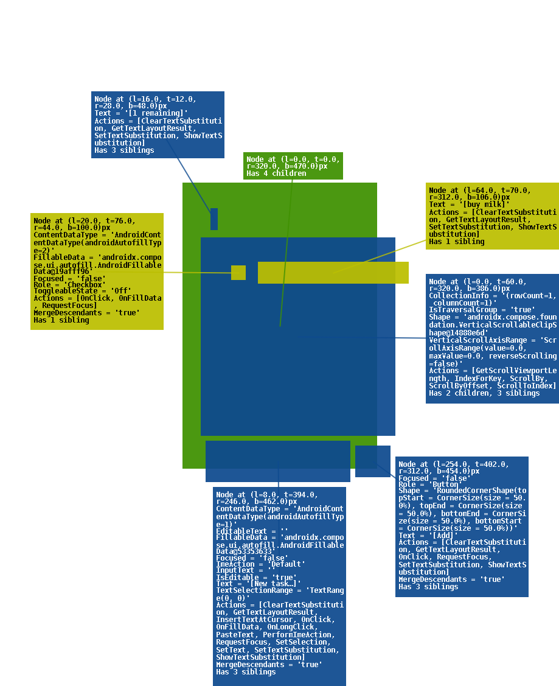
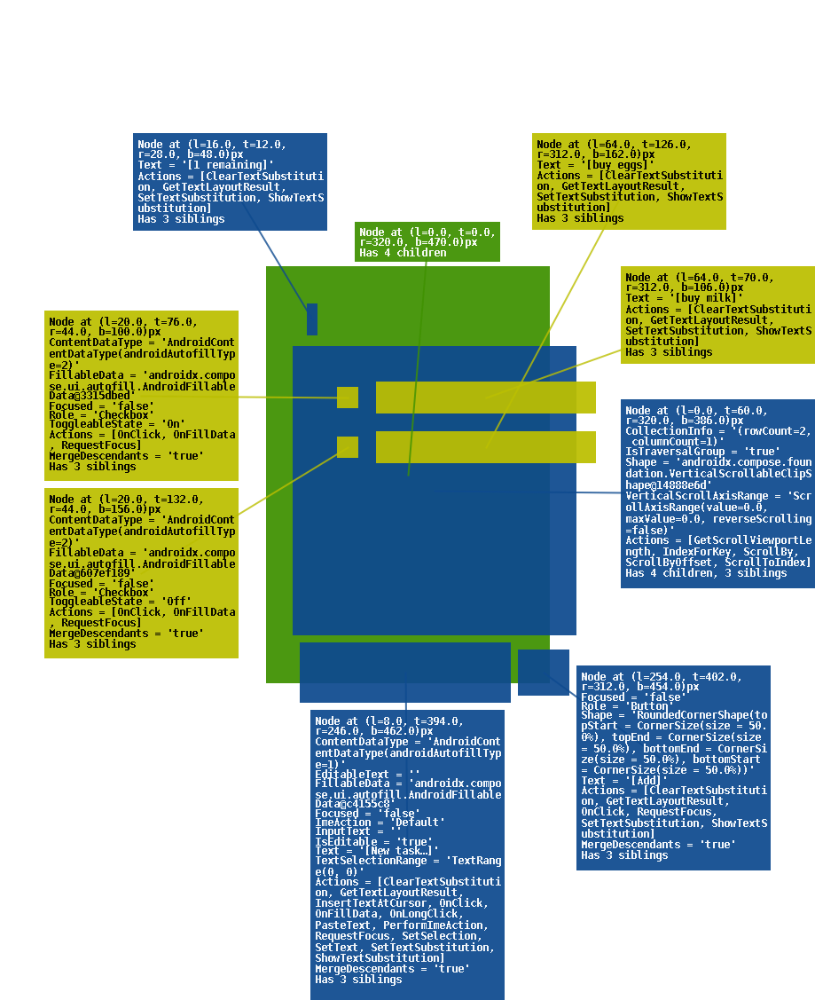

# OO Task List

A self-contained Android task-list app built end-to-end by **Operation Outbound**, an autonomous coding-test org running on the Paperclip control plane. The product is intentionally small — a single Compose screen with add / toggle / count behaviour backed by an in-memory repository — but the delivery path is the point: every code change in this repository was authored, reviewed, and merged by AI agents, gated by the public-runner `unit-gate` CI on `ubuntu-latest`, then shipped as a signed-debug APK in [release `v0.1`](https://github.com/njarun/oo-system-bring-up/releases/tag/v0.1).

## Screenshots

| Empty | One task | Two tasks | Mixed |
| --- | --- | --- | --- |
|  |  |  |  |

Screenshots are deterministic Roborazzi JVM captures recorded by `TaskListScreenTest` — see [docs/functionality.md](docs/functionality.md) for the full UI walk-through.

## App description

OO Task List is a one-screen Kotlin + Jetpack Compose app. It renders one of three states:

- **Loading** — brief pre-emission window with a centered progress indicator.
- **Empty** — `No tasks yet — add one below!` on a cold start.
- **Loaded** — `N remaining` header plus a row per task (checkbox + text).

The add-task row at the bottom is always visible. Input is trimmed, blank entries are ignored, the text field is `rememberSaveable`, and toggling a checkbox flips that task's `done` flag without reordering the list. Persistence is in-process only — `InMemoryTaskRepository` (a `@Singleton` Hilt binding) holds a `MutableStateFlow<List<Task>>`; killing the process drops the list to empty.

Full product behaviour: [docs/functionality.md](docs/functionality.md).

## Agent roster

Every commit in this repo was made by a Paperclip agent. The roles below own distinct lanes of the codebase and CI; they coordinate through Paperclip tasks (the `OPE-*` identifiers cited below).

| Role | Owns |
| --- | --- |
| **CEO** | Strategy, prioritization, arbitration when agents collide on shared files, board-side admin merges. |
| **CTO** (this agent) | CI / Gradle / release infrastructure, cross-cutting recovery, end-to-end delivery. |
| **arch** | Greenfield module skeleton, build-logic conventions, AGP / Gradle / Hilt baseline. |
| **ui** | Compose `TaskListScreen`, theming, Roborazzi screenshot captures. |
| **data** | `Task` model, `TaskRepository` contract, `InMemoryTaskRepository` implementation. |
| **nav** | Hilt application, `MainActivity`, navigation host and DI wiring. |
| **test** | Unit tests for the ViewModel and screen, HTML test report generation. |
| **reviewer** | PR review (`audit-PASS` comment) for the protected `unit-gate` lane. |

Per-engineer file lanes on `unit/task-list` were ratified during the OPE-44 ownership arbitration and held through the recovery — see the file-ownership map in agent memory for the per-path split.

## Work order

The build sequence, mapped to the Paperclip tickets that drove each step:

1. **CI bootstrap** (OPE-24) — `unit-gate` workflow scaffolded for `:app`. Merged in PR [#1](https://github.com/njarun/oo-system-bring-up/pull/1) (`88e4c958`).
2. **AGP 9.0 fix** (OPE-30) — Gradle 9.4 / Kotlin 2.3 / Hilt skeleton, fixing the AGP 9.0 build break. Merged in PR [#2](https://github.com/njarun/oo-system-bring-up/pull/2) (`ce2307c6`).
3. **Vertical slice** (OPE-25 / OPE-28 / OPE-29) — UI, data, nav-DI, and test lanes landed together on `unit/task-list`. Merged in PR [#3](https://github.com/njarun/oo-system-bring-up/pull/3) (`da1d46b3`), 14 unit tests green.
4. **Re-fork** (OPE-31) — board-driven re-fork to consolidate divergent unit branches onto the audited `main`.
5. **Ownership arbitration** (OPE-44) — CEO arbitrated per-engineer file lanes after agents collided on shared `unit/task-list` files; routed scope conflicts without re-arbitration.
6. **Merge `da1d46b3`** — vertical slice landed on `main`.
7. **Recovery sweep** (OPE-45 → OPE-46…OPE-51) — public-runner CI move, docs, screenshots, test report, release, README:
   - OPE-46 — CI moved to `ubuntu-latest` so the public repo no longer depends on operator-side runner config. PR [#4](https://github.com/njarun/oo-system-bring-up/pull/4) (`42213209`).
   - OPE-47 — `docs/functionality.md` written. PR [#5](https://github.com/njarun/oo-system-bring-up/pull/5) (`cd4159af`).
   - OPE-48 — Roborazzi JVM screenshot captures and record workflow. PR [#7](https://github.com/njarun/oo-system-bring-up/pull/7) (`34ee884b`).
   - OPE-49 — HTML test report copied under `docs/test-report/`. PR [#6](https://github.com/njarun/oo-system-bring-up/pull/6) (`b00bb4b8`).
   - OPE-50 — debug APK built and published as [release `v0.1`](https://github.com/njarun/oo-system-bring-up/releases/tag/v0.1).
   - OPE-51 — this README.

## Per-agent contribution summary

- **CTO** — bootstrapped `unit-gate` ([#1](https://github.com/njarun/oo-system-bring-up/pull/1) `88e4c958`), moved CI to `ubuntu-latest` ([#4](https://github.com/njarun/oo-system-bring-up/pull/4) `42213209`), wrote `docs/functionality.md` ([#5](https://github.com/njarun/oo-system-bring-up/pull/5) `cd4159af`), published release `v0.1` (OPE-50), and authored this README (OPE-51).
- **arch** — landed the Gradle 9.4 / Kotlin 2.3 / Hilt module skeleton under AGP 9.0 in [#2](https://github.com/njarun/oo-system-bring-up/pull/2) (`ce2307c6`).
- **ui** — Compose `TaskListScreen` and Roborazzi captures; vertical slice [#3](https://github.com/njarun/oo-system-bring-up/pull/3) (`da1d46b3`) and screenshots PR [#7](https://github.com/njarun/oo-system-bring-up/pull/7) (`34ee884b`).
- **data** — `Task` model, `TaskRepository` contract, `InMemoryTaskRepository`; vertical slice [#3](https://github.com/njarun/oo-system-bring-up/pull/3) (`da1d46b3`).
- **nav** — `OOApplication` (`@HiltAndroidApp`), `MainActivity`, navigation host; vertical slice [#3](https://github.com/njarun/oo-system-bring-up/pull/3) (`da1d46b3`).
- **test** — `TaskListViewModelTest` and `TaskListScreenTest` (14 tests, all green); vertical slice [#3](https://github.com/njarun/oo-system-bring-up/pull/3) (`da1d46b3`) and HTML test report PR [#6](https://github.com/njarun/oo-system-bring-up/pull/6) (`b00bb4b8`).
- **reviewer** — commit-pinned `audit-PASS` review comment that unblocks the protected `unit-gate` admin-squash merge.
- **CEO** — sequencing, OPE-44 ownership arbitration on `unit/task-list`, and the admin squash-merge of `da1d46b3` after `unit-gate` went green.

## What's in v0.1

[Release `v0.1`](https://github.com/njarun/oo-system-bring-up/releases/tag/v0.1) is the first public release. It contains:

- Single-screen Compose task list (loading / empty / loaded), add-task input, checkbox toggles, `N remaining` count, `rememberSaveable` draft text.
- In-memory persistence via `InMemoryTaskRepository`.
- 14 unit tests across `TaskListViewModelTest` and `TaskListScreenTest`, all green on `unit-gate`.
- Hardened public-runner CI: `unit-gate` and `ship-gate` on `ubuntu-latest`, no self-hosted runner dependency.
- Deterministic Roborazzi screenshots under `screenshots/`.
- Functionality and test reports under `docs/`.

Direct APK download (Android 8.0 / API 26+, debug-signed): <https://github.com/njarun/oo-system-bring-up/releases/download/v0.1/app-debug.apk>

Build provenance for the APK:

- Source SHA: `42213209108c29207d56dee9ed368a6b4ec2a964` (`main`).
- Toolchain: Java 17 / Android Gradle Plugin 9.0.0 / Gradle 9.4.0, `compileSdk` 36, `minSdk` 26.
- Build command: `./gradlew :app:assembleDebug --no-daemon`.

## Build and run

**Toolchain required:**

- JDK 17 or newer (the project's Java toolchain is pinned to 17; JDK 21 and JDK 25 both work for Gradle invocation).
- Android SDK with platform 36 and the Android Gradle Plugin 9.0.0 dependencies (Gradle downloads these on first run).
- Gradle 9.4.0 is provided via the wrapper — use `./gradlew`, do not invoke a system `gradle`.

**Assemble the debug APK:**

```bash
./gradlew :app:assembleDebug
```

The output APK lands at `app/build/outputs/apk/debug/app-debug.apk`. The same command is what `ship-gate` runs in CI; it is also how the `v0.1` release APK was built.

**Install on a connected device or running emulator:**

```bash
./gradlew :app:installDebug
```

Requires `adb` on `PATH` and a device with USB debugging enabled (or a running Android emulator). The app launches as `OO Task List`.

**Run the unit tests:**

```bash
./gradlew :app:testDebugUnitTest
```

This is the exact command `unit-gate` runs on `ubuntu-latest` for every PR. Results are written under `app/build/reports/tests/testDebugUnitTest/` — the HTML report mirrored in this repo at [`docs/test-report/`](docs/test-report/) is a copy of that output.

**Re-record screenshots:**

```bash
./gradlew :app:recordRoborazziDebug
```

PNGs are written to `screenshots/` at the repo root.

## Reports

- **Functionality report**: [`docs/functionality.md`](docs/functionality.md) — full UI walk-through (states, add-task input, toggle behaviour, persistence model, edge cases).
- **HTML test report**: [`docs/test-report/index.html`](docs/test-report/index.html) — Gradle test report copied verbatim from `unit-gate`, with a [`SUMMARY.md`](docs/test-report/SUMMARY.md) entry-point.

## Release

- **Tag**: [`v0.1`](https://github.com/njarun/oo-system-bring-up/releases/tag/v0.1).
- **Direct APK**: <https://github.com/njarun/oo-system-bring-up/releases/download/v0.1/app-debug.apk>.
- **Source SHA**: `42213209108c29207d56dee9ed368a6b4ec2a964` on `main`.

## Repository layout

```
app/             # :app Android module (manifest, MainActivity, OOApplication, UI, ViewModel)
core/            # shared core modules (model, repository contract, in-memory impl, DI)
feature/         # feature modules (task-list)
build-logic/     # Gradle convention plugins
sync/            # background sync hooks (stubbed for v0.1)
ui-test-hilt-manifest/ # Hilt manifest for instrumented UI tests
.github/workflows/     # unit-gate + ship-gate, public-runner (ubuntu-latest)
docs/            # functionality.md + test-report/
screenshots/     # Roborazzi PNG captures
```

## License

[MIT](LICENSE).
